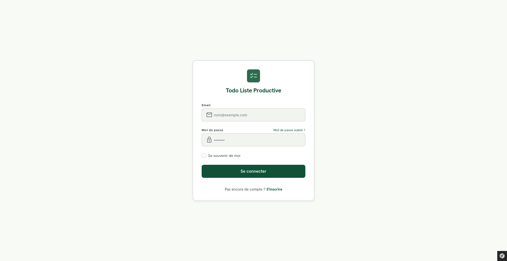
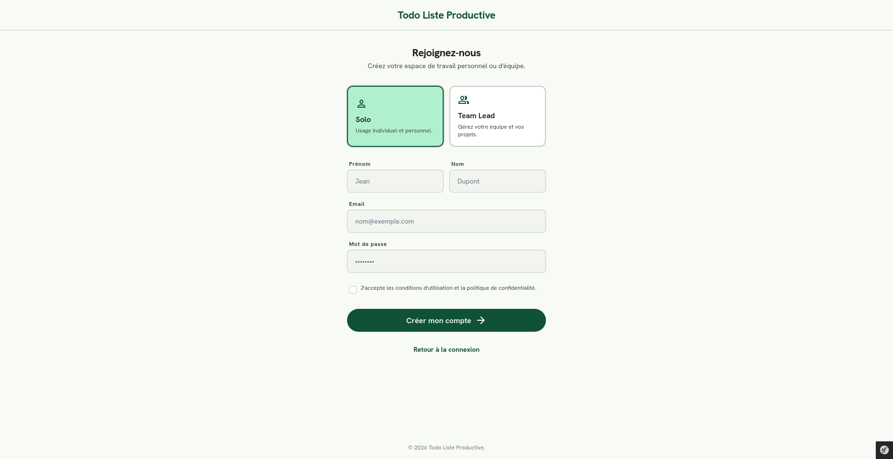
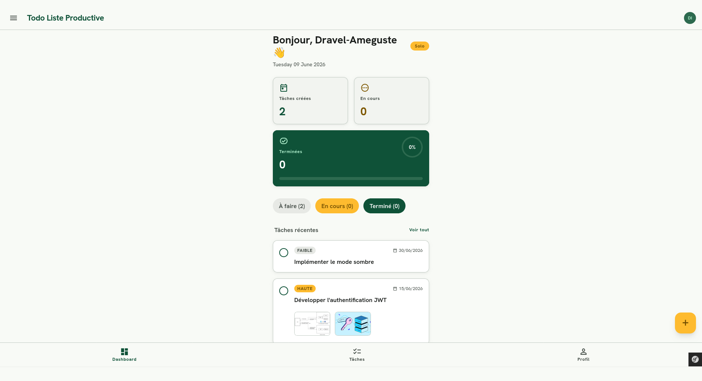
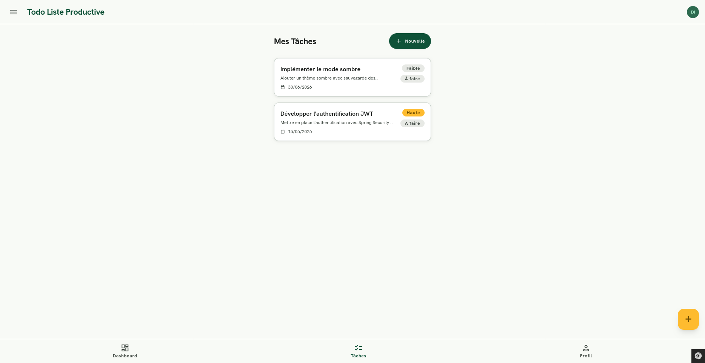
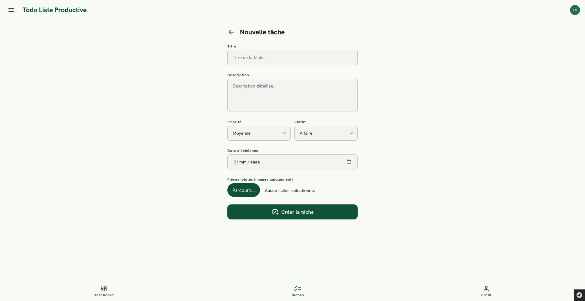
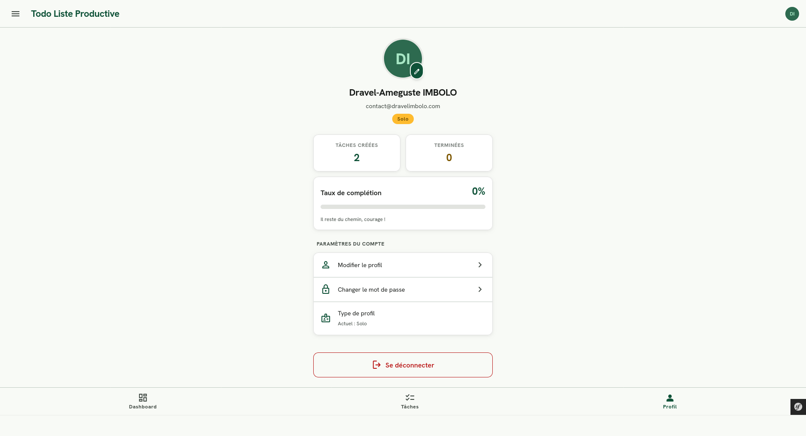

**`Projet Full Stack · Symfony 8 · PHP 8.4 · MySQL 8`**

_Une application de gestion de tâches avec authentification, priorités, statuts et pièces jointes._

 

 

 

---

_Gérez vos tâches par priorité et statut, assignez-les à des membres de votre équipe et suivez leur avancement, avec un système d'authentification complet et une couverture de tests robuste._

---

## _Stack technique_

<table align="center">
<tr>
  <td align="center">
    <strong>Backend</strong> 
    
  </td>
  <td align="center">
    <strong>Frontend</strong> 
    
  </td>
  <td align="center">
    <strong>Base de données</strong> 
    
  </td>
  <td align="center">
    <strong>DevOps & Outils</strong> 
    
  </td>
</tr>
</table>

---

## _Aperçu_

<table align="center" style="border-spacing:8px;">
<tr>
  <td align="center">
    
     Connexion
  </td>
  <td align="center">
    
     Inscription
  </td>
  <td align="center">
    
     Dashboard
  </td>
</tr>
<tr>
  <td align="center">
    
     Liste des tâches
  </td>
  <td align="center">
    
     Nouvelle tâche
  </td>
  <td align="center">
    
     Profil
  </td>
</tr>
</table>

---

## _Architecture_

<table style="border-spacing:0; font-size:13px; width:100%;">
<tr>
  <th align="left" style="padding:8px 12px; width:22%;">Dossier</th>
  <th align="left" style="padding:8px 12px;">Contenu</th>
</tr>
<tr>
  <td style="padding:8px 12px;"><code>src/Controller/</code></td>
  <td style="padding:8px 12px;"><code>DashboardController</code> · <code>TaskController</code> · <code>ProfileController</code> · <code>SecurityController</code></td>
</tr>
<tr>
  <td style="padding:8px 12px;"><code>src/Entity/</code></td>
  <td style="padding:8px 12px;"><code>User</code> · <code>Task</code> · <code>Attachment</code> : UUID BINARY(16), soft delete sur Task</td>
</tr>
<tr>
  <td style="padding:8px 12px;"><code>src/Service/</code></td>
  <td style="padding:8px 12px;"><code>AuthService</code> · <code>TaskService</code> · <code>UserService</code> · <code>DashboardService</code></td>
</tr>
<tr>
  <td style="padding:8px 12px;"><code>src/DTO/</code></td>
  <td style="padding:8px 12px;"><code>RegisterDTO</code> · <code>CreateTaskDTO</code> · <code>UpdateProfileDTO</code> · <code>ChangePasswordDTO</code></td>
</tr>
<tr>
  <td style="padding:8px 12px;"><code>src/Security/</code></td>
  <td style="padding:8px 12px;"><code>AppAuthenticator</code> · <code>Voter/TaskVoter</code></td>
</tr>
<tr>
  <td style="padding:8px 12px;"><code>src/Enum/</code></td>
  <td style="padding:8px 12px;"><code>TaskPriority</code> (LOW · MEDIUM · HIGH · URGENT) · <code>TaskStatus</code> (TODO · IN_PROGRESS · DONE) · <code>ProfileType</code></td>
</tr>
<tr>
  <td style="padding:8px 12px;"><code>tests/</code></td>
  <td style="padding:8px 12px;">Unit (<code>AuthServiceTest</code> · <code>TaskServiceTest</code> · <code>DashboardServiceTest</code>) · Functional (<code>SecurityControllerTest</code> · <code>TaskControllerTest</code>)</td>
</tr>
<tr>
  <td style="padding:8px 12px;"><code>docs/adr/</code></td>
  <td style="padding:8px 12px;"><code>001-uuid-binaire.md</code> · <code>002-soft-delete.md</code></td>
</tr>
<tr>
  <td style="padding:8px 12px;"><code>.github/</code></td>
  <td style="padding:8px 12px;"><code>workflows/ci.yml</code> · <code>workflows/deploy.yml</code> · <code>PULL_REQUEST_TEMPLATE.md</code></td>
</tr>
</table>

---

## _Installation_

<table align="center" style="border-spacing:0; font-size:13px; width:100%;">
<tr>
  <th align="left" style="padding:8px 12px;">Étape</th>
  <th align="left" style="padding:8px 12px;">Commande</th>
  <th align="left" style="padding:8px 12px;">Description</th>
</tr>
<tr>
  <td align="center" style="padding:8px 12px;"><code>1</code></td>
  <td style="padding:8px 12px;"><code>git clone https://github.com/dravelimbolo/todo-liste-symfony.git && cd todo-liste-symfony</code></td>
  <td style="padding:8px 12px;">Cloner le dépôt</td>
</tr>
<tr>
  <td align="center" style="padding:8px 12px;"><code>2</code></td>
  <td style="padding:8px 12px;"><code>cp .env.example .env</code></td>
  <td style="padding:8px 12px;">Créer le fichier d'environnement</td>
</tr>
<tr>
  <td align="center" style="padding:8px 12px;"><code>3</code></td>
  <td style="padding:8px 12px;"><code>docker compose up -d</code></td>
  <td style="padding:8px 12px;">Démarrer PHP, Nginx, MySQL, Mailpit</td>
</tr>
<tr>
  <td align="center" style="padding:8px 12px;"><code>4</code></td>
  <td style="padding:8px 12px;"><code>docker compose exec php composer install</code></td>
  <td style="padding:8px 12px;">Installer les dépendances PHP</td>
</tr>
<tr>
  <td align="center" style="padding:8px 12px;"><code>5</code></td>
  <td style="padding:8px 12px;"><code>docker compose exec php php bin/console doctrine:migrations:migrate</code></td>
  <td style="padding:8px 12px;">Appliquer les migrations</td>
</tr>
<tr>
  <td align="center" style="padding:8px 12px;"><code>6</code></td>
  <td style="padding:8px 12px;"><code>docker compose exec php php bin/console doctrine:fixtures:load</code></td>
  <td style="padding:8px 12px;">Charger les données de démonstration <em>(optionnel)</em></td>
</tr>
<tr>
  <td align="center" style="padding:8px 12px;"><code>7</code></td>
  <td style="padding:8px 12px;"><code>http://localhost</code></td>
  <td style="padding:8px 12px;">Ouvrir l'application dans le navigateur</td>
</tr>
</table>

### Tests

<table align="center" style="border-spacing:0; font-size:13px; width:100%;">
<tr>
  <th align="left" style="padding:8px 12px;">Commande</th>
  <th align="left" style="padding:8px 12px;">Description</th>
</tr>
<tr>
  <td style="padding:8px 12px;"><code>vendor/bin/phpunit</code></td>
  <td style="padding:8px 12px;">Lancer toute la suite de tests</td>
</tr>
<tr>
  <td style="padding:8px 12px;"><code>vendor/bin/phpunit --testsuite Unit</code></td>
  <td style="padding:8px 12px;">Tests unitaires uniquement</td>
</tr>
<tr>
  <td style="padding:8px 12px;"><code>vendor/bin/phpunit --testsuite Functional</code></td>
  <td style="padding:8px 12px;">Tests fonctionnels uniquement</td>
</tr>
<tr>
  <td style="padding:8px 12px;"><code>vendor/bin/phpunit --coverage-html coverage/</code></td>
  <td style="padding:8px 12px;">Rapport de couverture HTML</td>
</tr>
<tr>
  <td style="padding:8px 12px;"><code>vendor/bin/phpstan analyse --configuration=phpstan.dist.neon</code></td>
  <td style="padding:8px 12px;">Analyse statique niveau 8</td>
</tr>
<tr>
  <td style="padding:8px 12px;"><code>vendor/bin/php-cs-fixer fix --dry-run</code></td>
  <td style="padding:8px 12px;">Vérifier le style du code</td>
</tr>
<tr>
  <td style="padding:8px 12px;"><code>composer audit</code></td>
  <td style="padding:8px 12px;">Audit des vulnérabilités</td>
</tr>
</table>

---

 

_"Transformons des idées en applications fonctionnelles, robustes et scalables."_

 

